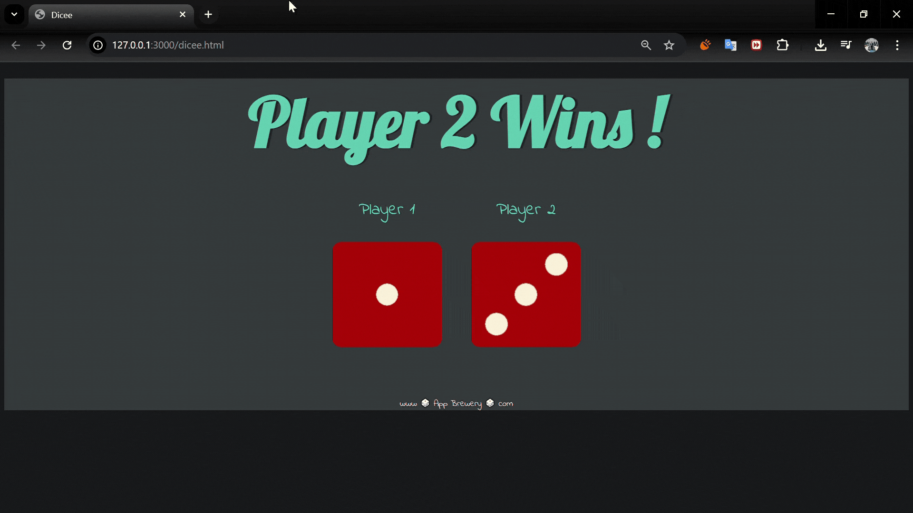

# 🎲 Dicee Game  

A simple dice game built with JavaScript. Each refresh rolls two dice, and the player with the higher number wins 🏆  

---

## 🚀 Features
- Random dice roll on every refresh  
- Automatically detects the winner  
- Simple and clean design using **HTML + CSS + JavaScript**  
- Great practice for **DOM Manipulation** and **Math.random()**  

---

## 📸 Screenshot


---

## 🛠️ Tech Stack
- HTML5  
- CSS3  
- JavaScript (DOM, Math.random, setAttribute)  

---

## 📂 How to Run
1. Clone this repo:  
   ```bash
   git clone https://github.com/KareemYaseen/dicee-game.git
